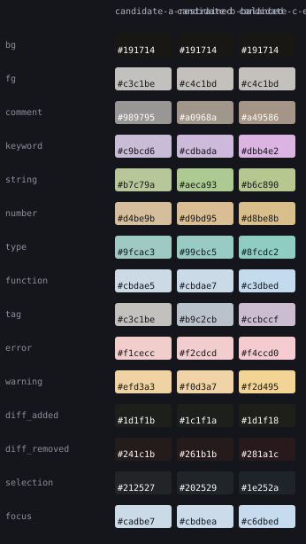

# Grotto

Grotto is a set of experimental coding themes for VS Code and Zed. Three color
families, Restrained, Balanced, and Expressive, each have Day, Evening, and Night
variants. Day is light; Evening and Night are dark. You switch them manually.

The themes are ready to try. Choosing and refining a family for release is still
open work.

## Try a theme

Follow the [VS Code installation guide](editors/vscode/README.md) or the
[Zed installation guide](editors/zed/README.md), then choose a `Grotto` theme in
your editor. Both extensions contain only static theme data.

These are the Night palettes:



For code examples, open [the comparison report](out/candidates/comparison.html)
from a local checkout. It includes specimens and diagnostic states under normal
and simulated color vision. Your editor's grammar and font affect the result.

Use familiar code for a session. Check comments, selected text, search matches,
errors, warnings, and diffs. [Report an issue](https://github.com/sims1253/grotto/issues)
with the family, variant, editor, language, font, and an example of what was hard
to read. The [formal evaluation protocol](HUMAN_EVALUATION.md) is optional for
people who want a structured comparison.

## What needs work

The [visual design review](docs/review/README.md) compares the current themes
with the Night experiments and proposes a simpler authoring path.

The Night families can look too similar. Some Day selection and diff colors
are too close, and error/warning separation weakens in Restrained. The
[Night experiments](NUMERIC.md) explore alternatives; they are not included in
the editor previews.

Before a public release, choose a family, resolve its readability problems, and
test the packaged themes in real editors. Capture editor screenshots and share
the tested VSIX as a prerelease. Marketplace publication also needs a registered
publisher; the package currently uses the local `grotto-local` identity.

## Develop

From the repository root, with Python 3.12+ and uv:

```bash
uv sync --locked
uv run pytest -q
```

[The toolkit guide](docs/TOOLKIT.md) covers regeneration and evaluation. VSIX
packaging commands live in the [VS Code guide](editors/vscode/README.md).

Color roles, palettes, and editor mappings are separate:

```text
spec/roles.yaml + spec/environments.yaml + spec/bindings/
  -> themes/candidates/       generated palettes
     + spec/mappings/        editor-specific rules
       -> editors/           installable themes
```

The toolkit checks contrast, color separation, and consistency between variants.
These checks expose tradeoffs; they do not establish a preferred theme or a
health benefit. See the [design](DESIGN.md) and [research](RESEARCH.md) for the
reasoning and limits.

[MIT license](LICENSE).
