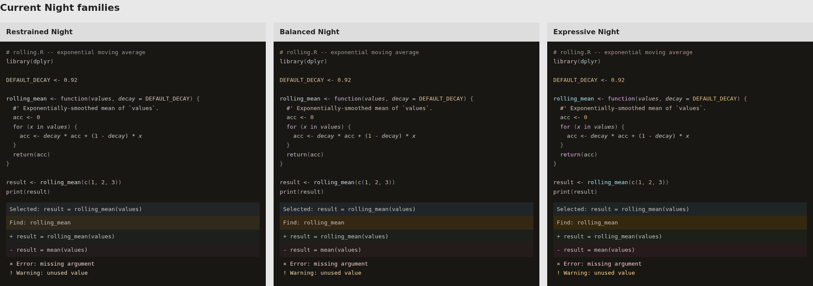
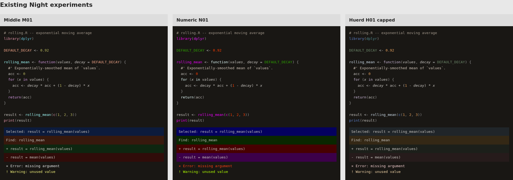
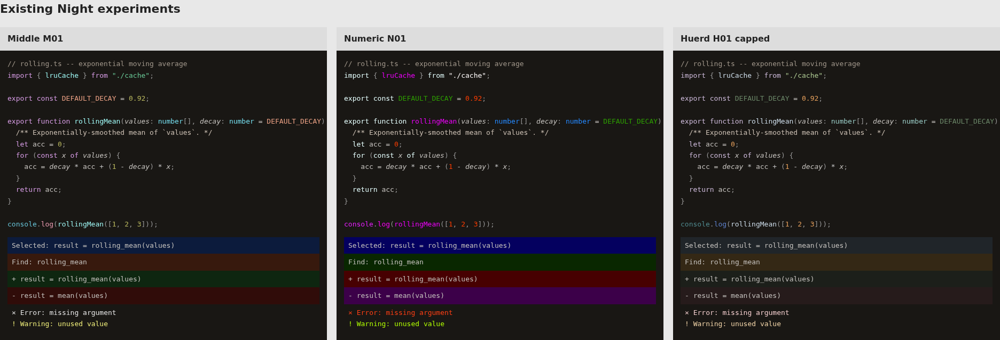
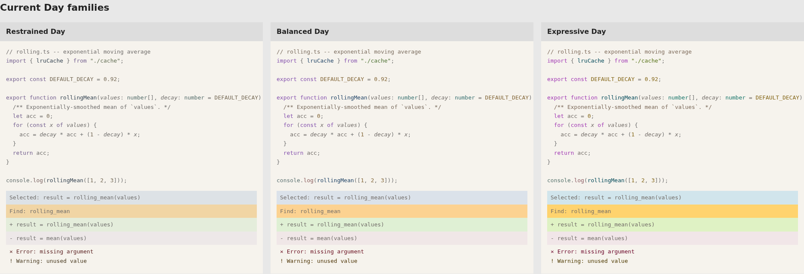
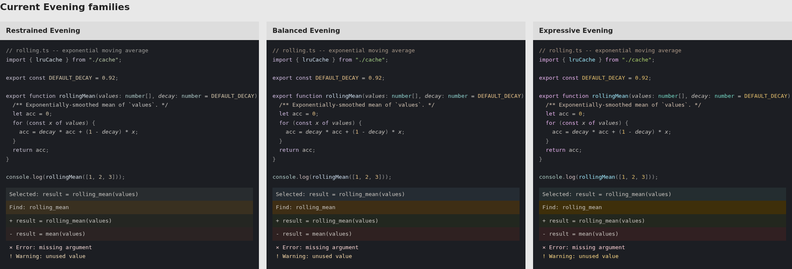
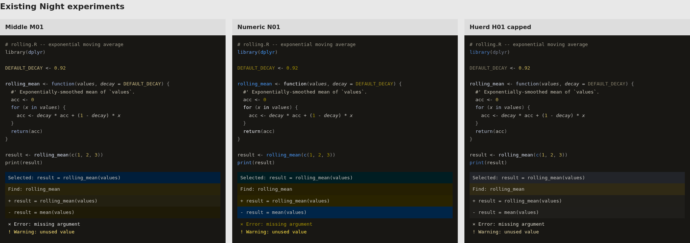

# Grotto: choose the theme, then simplify the system

My recommendation is to keep the measurement code and editor mappings, replace
the palette-authoring workflow, and develop one family from the Middle M01 Night
experiment. Give Day its own authored palette. Keep Evening as an experiment
until it offers a useful choice beyond the other two.

This is a design proposal for review, not a selected theme or a rewrite of the
runtime. The screenshots below are the evidence for my visual judgment. You may
prefer a different look.

## What the project should deliver

A coding theme you want to use for hours, with readable code and UI states in
bright and dim rooms. Switching variants should preserve recognizable syntax
roles. Installation should be ordinary, and changing a color should be easy.

The current specification instead commits to shipping a defensible model even
if its palette is modest ([DESIGN.md, section 1](../../DESIGN.md)). That helped
build the research tools, but it makes the model the product. A theme release
needs a different order: design, inspect, check, revise, then export.

Several design assumptions should become choices we can reject:

| Current assumption | What the product needs instead |
| --- | --- |
| Three families times three environments | One coherent family; each extra variant must earn its maintenance cost |
| Every syntax distinction needs a color-distance floor | Distinguish roles that help reading; a number and a named constant need not have different hues just to improve a score |
| A shared contrast target defines the right emphasis | Author the hierarchy on code, then check whether all text remains readable |
| More distinct hues necessarily reduce coherence | Judge the composition; the display gamut limits each color, not a shared pool of chroma consumed by all tokens |
| Cross-variant stability requires the same derivation formula | Preserve recognizable role colors while allowing each polarity its own lightness and surfaces |
| A long evaluation protocol must precede any useful preference decision | Use these examples to choose a direction, then test sustained use; reserve formal claims for formal evidence |

The original adaptive idea remains useful. What is unproven is the exact count
of variants and the formula used to derive them. Rebuilding those formulas from
scratch before choosing a look would repeat the same mistake.

## Look at the current choices

These images use the same authored R or TypeScript spans, font, size, and
background for each relevant comparison. They are browser specimens, not VS Code
screenshots. The state rows use palette colors directly; actual editor overlays,
semantic tokens, and grammar rules can differ. Open an image at full size.



Restrained makes the code read mostly as gray and beige. Balanced brings out the
constant and function slightly. Expressive makes the function cyan and the
keyword purple enough to read as distinct accents. I can see a difference, so
"all three are identical" overstates the current result. The hierarchy and UI
states still look much alike. Three settings of restraint do not yet justify
three separate product families.



Middle M01 gives functions cyan, constants orange, numbers yellow, and keywords
purple. The body stays neutral. This is the best starting point to my eye, but
its pink builtins draw attention to `library` and `print`, and its error text
looks almost neutral. I would revise both before shipping.

Numeric N01 pulls my attention toward magenta calls and green constants. Its
removed-line fill is purple and its added-line fill is red. Those choices follow
the search objective but conflict with the familiar red/green diff convention.
It demonstrates that higher distance scores do not choose the design we want.

Huerd H01 capped adds orange numbers and blue builtins while preserving most of
Balanced. It is a smaller change, and it leaves the weak separation of the UI
states. Its green constant is also less prominent than the surrounding text in
this example. I would keep it as a comparison, not start another search from it.



The TypeScript example reinforces that judgment. Middle's orange constant and
cyan function stay recognizable in both languages. Numeric shifts emphasis
between keyword, function, constant, and primitive type in a way I find uneven.
These are my reactions to the images, not measured reading-speed results.

## Day and adaptation need design work too



The light canvas works as a distinct option. Expressive's purple keywords pull
strongly against the gray body, while Restrained is much quieter. In all three,
selected ordinary text is visibly subdued. The fresh checks below confirm a
contrast loss on selection. Increasing keyword saturation will not fix that.



Evening is cooler than Night, but its code hierarchy and UI treatments remain
close. It adds another set of colors and editor checks before we have established
that users need it. I suggest Day and Night for the first family, with manual
switching. If Evening feels materially better in your room, keep it and record
what makes it useful. Automatic switching can wait until the endpoints work.

## The checks should stop shipping failures

Fresh ratios from the rendered palette inputs are in [evidence.json](evidence.json).
These are specific foreground/background pairs, not a whole-theme accessibility
claim. The project's body-text floor is 4.5:1.

| Palette | Ordinary text on canvas | Ordinary text on selection | Comment on canvas |
| --- | ---: | ---: | ---: |
| Balanced Day | 4.62 | 3.92 | 4.52 |
| Expressive Day | 4.61 | 3.92 | 4.51 |
| Balanced Night | 9.97 | 8.62 | 6.15 |
| Middle M01 | 9.97 | 9.46 | 6.15 |
| Numeric N01 | 9.97 | 10.01 | 6.15 |

The Day foreground/selection failure is accepted by
[`_ink_on_surface_issues`](../../src/grotto/model.py): it records a warning rather
than failing the build. The VS Code exporter checks candidate status but does
not require this issue to be resolved. Passing generator tests therefore does
not establish release readiness.

Keep exploratory generation permissive so we can inspect bad ideas. Make the
release export reject failed text/surface pairs in the actual editor mapping,
including composited overlays where the mapping uses alpha. Keep preference
scores out of that release check.



Under this simulation, Middle's added and removed fills become similar, and
Numeric's error and warning colors converge. The text labels and signs still
carry meaning. Requiring every pair of underlying colors to be far apart ignores
those other channels. Check diagnostic meaning in context instead of treating
one all-pairs distance objective as a quality score.

These are population-average simulations, not an individual vision assessment.
Night's foreground contrast also stays about 10:1 across these options. Warmer
hues alone do not demonstrate lower glare, comfort, or less light exposure.

## Rebuild the authoring layer, not the project

The useful parts already work independently of the generator:

- `color`, `contrast`, `cvd`, and `spec` provide color conversion, checks, and
  concrete role-to-color palettes. Keep their tests.
- Editor mappings express useful scope knowledge, including the R and TS/JS
  argument fixes. Keep them.
- Code specimens and reports let us inspect a palette before installing it.
  Keep one rendering path. This review reuses it.

The part to replace is the production path through the global transform. Its
shared APCA targets, chroma classes, candidate/family/role scales, caps, and
warm-hue attraction make a direct visual edit difficult to express. These are
largely taste choices. They need not be universal rules for every palette.

The actual attenuation factor is `1 - attenuation * night_adaptation`
([`chroma_components`](../../src/grotto/model.py)), not multiplication by 0.35.
The first description in NUMERIC.md blurred that distinction. The broader
problem remains the number of interacting controls and shared targets, not
that one constant alone explains the result.

Proposed production flow:

```text
Author one family's Day and Night colors in OKLCH
  -> load concrete Palette objects
  -> inspect the same code and UI states
  -> check gamut, text contrast, and critical-state meaning
  -> apply the existing editor mappings
  -> inspect and package the editor themes
```

Concretely, let editor exporters accept named `Palette` objects instead of
requiring nine `candidate-*.yaml` files. Keep explicit colors per variant, with
shared role names and a review of hue changes. A small amount of duplicated
palette data is easier to edit than another system of scale factors and overrides.
The current transform can remain an optional experiment that also returns
`Palette` objects. It should not rewrite authored colors during release builds.

After the new path reproduces the chosen colors in both editors, retire the
hardcoded three-family registry and nine-theme assumptions from the release
path. Freeze the search scripts and their reports as research. Do not rewrite
the measurement library or rerun optimizers to postpone the visual decision.

A complete rebuild would discard tested color math and editor behavior while
leaving the palette choice unresolved. Keeping the current authoring system
unchanged would preserve the mechanism that made the candidates converge.
Replacing this boundary addresses the specific problem.

## The choice for this PR

| Direction | Starting point | Tradeoff |
| --- | --- | --- |
| Smaller palette change | Expressive Night, then repair Day and UI states | Keeps a quiet look; current families remain close |
| My recommendation | Middle M01, with quieter builtins and clearer errors; author a matching Day | More visible syntax roles; needs deliberate refinement |
| Strong color throughout | Numeric N01, then revise the role colors and diff conventions | Much more saturated; highest risk of distracting accents |

Choose the row closest to what you want, and point to any colors you want kept
or changed. The architecture recommendation applies to all three. Huerd is shown
as a narrower alternative to help explain the tradeoff.

You can try the existing inputs without installing into your normal profile:

```bash
# Run one command at a time from the repository root.
code --extensionDevelopmentPath="$PWD/editors/vscode"
code --extensionDevelopmentPath="$PWD/out/middle-night/vscode-preview"
code --extensionDevelopmentPath="$PWD/out/numeric-night/vscode-preview"
```

Pick the matching theme in each development window. The experiment packages
include more than the first option shown here; check the label before comparing.
For these examples, choose `Grotto Expressive Night`, `Grotto M-Explore 01 Night`,
or `Grotto N-Explore 01 Night`, respectively.
This PR does not select or replace the installed themes.

## Review artifacts

Open [comparison.html](comparison.html) locally for both languages, all nine
current variants, three Night experiments, and four vision modes. The PNGs are
browser captures at 1920px viewport width, device scale 1, with DejaVu Sans Mono
at 13px. Font rendering and your display affect the result.

Rebuild the HTML and source-hashed contrast evidence with:

```bash
uv run python docs/review/build.py
```

The script reads the committed experiment results; it does not rerun searches.
Huerd H01 capped is Balanced Night with the `h01-capped` assignment from
`out/huerd-night/results.json`. Both source hashes are recorded. Screenshots are
fixed review illustrations; recapture them if the inputs or layout change.
