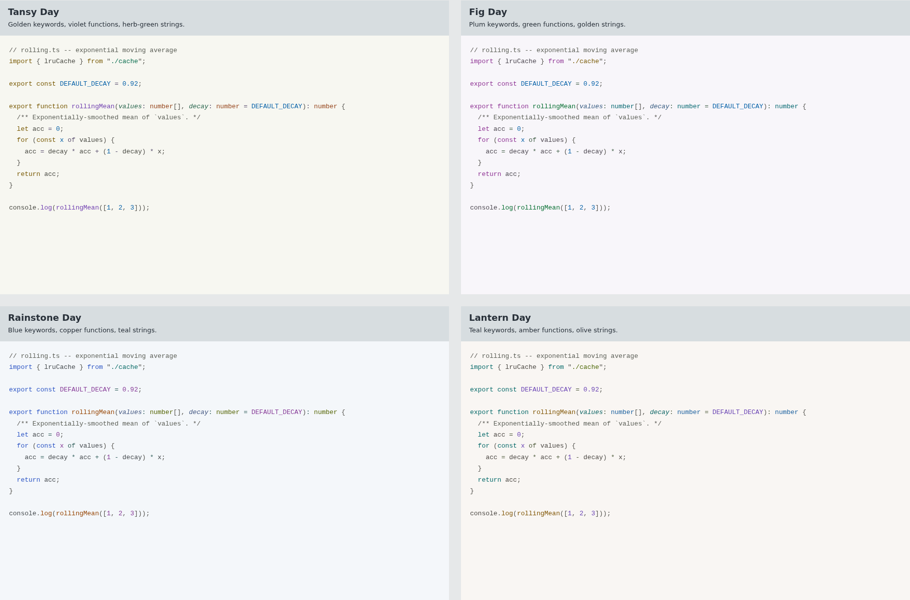
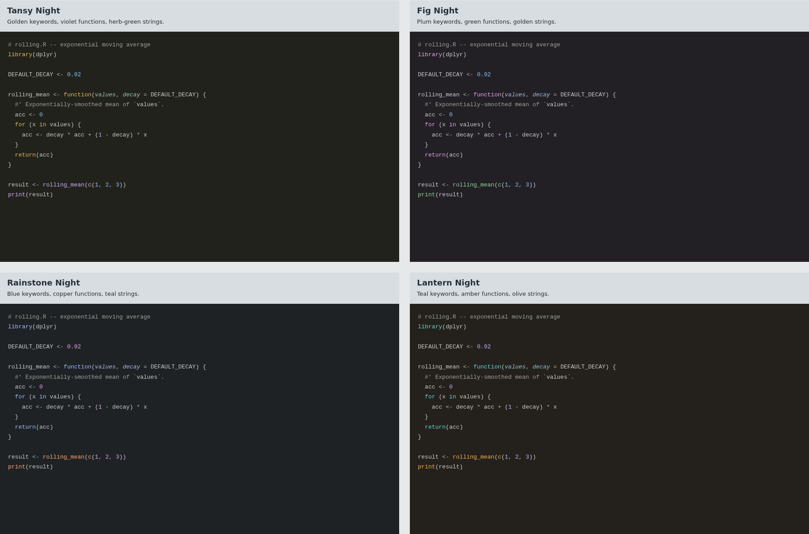

# Grotto studies

[Open the gallery](comparison.html). Start with all four, then choose
**Compare two** to put any pair beside each other. The current Pergola is also
available in the comparison selectors. Every direction has Day and Night.

| Direction | Keywords | Functions | Strings | Character |
| --- | --- | --- | --- | --- |
| Tansy | Gold | Violet | Herb green | Warm control flow, cool calls |
| Fig | Plum | Green | Gold | More playful; pale violet / dark plum canvas |
| Rainstone | Blue | Copper | Teal | The clearest cool/warm split |
| Lantern | Teal | Amber | Olive | Warm calls against quiet stone |





My starting picks are **Fig Day** and **Lantern Night**. Rainstone is the cooler
alternative; Tansy makes warm keywords a frequent part of the page.

## What to look at

The gallery uses actual exported TextMate theme rules through Shiki 4.4.3.
Choose TypeScript, Python, R, JSON or CSS. JSON and CSS test different color
proportions from a function body. All specimens use the same font and size.

[Selections, diagnostics and color-vision simulations](role-specimens.html)
use the toolkit's hand-labelled roles. Actual editor semantic highlighting can
change those assignments; neither browser view is an editor screenshot.

The [design notes](design-notes.md) record the initial directions and screenshot
critique. Lantern's type color changed from red to blue after the JSON preview
made red keys look too much like a diagnostic. Other differences are intentional
choices for review, not a ranking from an optimizer.

## Install

In VS Code, run **Extensions: Install from VSIX...** and select
`dist/grotto-studies-0.1.0.vsix` from the repository root. Then choose one of the
**Grotto Tansy**, **Grotto Fig**, **Grotto Rainstone** or **Grotto Lantern** themes.

For Zed, choose **Install Dev Extension** and select `out/grotto-studies/zed-preview`.
The previews have a separate extension ID and coexist with the earlier sets.
Switching is manual.

[Cove, Grove and Dusk](../next-generation/README.md) and
[Pergola and Stone](../summer-memories/README.md) remain available unchanged.

## Checks and limits

All eight themes pass the configured contrast floors across 289 authored
ink/surface combinations and 29 modeled editor backgrounds per theme, including
alpha composition. Minimum checked body-text contrast exceeds 4.60:1.
[metrics.json](metrics.json) records the audits and requested/shipped colors.

Day uses stronger chroma than Night. The gamut fractions, hues and role
assignments are design choices. Contrast checks do not establish comfort or
certify the whole editor. Color-vision simulations still show overlapping hues;
errors/warnings need labels or distinct icons, and diffs need signs.

The gallery was checked in all five languages and both variants, including
pair comparisons, mobile width and keyboard focus. A full suite run passed
541 tests; the final color adjustment was also checked with the nine study tests.
A real-editor smoke test and sustained use remain part of release review.

## Rebuild

From the repository root:

```sh
uv run python scripts/study_palette.py
uv run pytest -q tests/test_study_palette.py
```

The generator writes palette files, editor exports and role specimens. To build
the gallery, install `shiki@4.4.3` in a temporary Node project, copy
`scripts/study_preview.mjs` there, and run it with the absolute repository path:

```sh
node study_preview.mjs /absolute/path/to/grotto
```

With Python Playwright and Chromium installed, capture screenshots from the
repository root with `python3 scripts/capture_studies.py`. Captures use a 1920px
viewport, device scale 1, and DejaVu Sans Mono at 13px.

Package the extension from `out/grotto-studies/vscode-preview`:

```sh
npx --yes @vscode/vsce@3.9.2 package --no-dependencies --out ../../../dist/grotto-studies-0.1.0.vsix
```

[inputs.json](inputs.json) records generator input hashes;
[preview-inputs.json](preview-inputs.json) records the theme snapshots used by
the gallery. [token-colors.json](token-colors.json) records rendered color counts.
