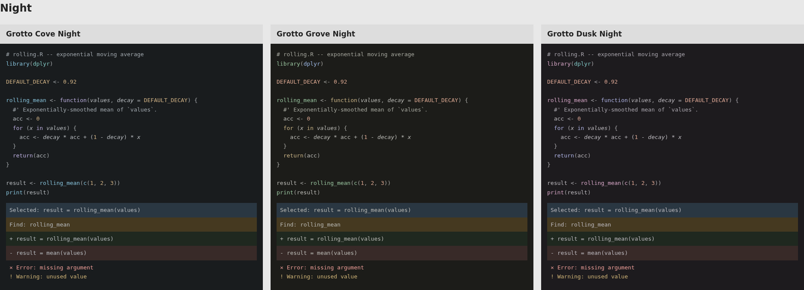
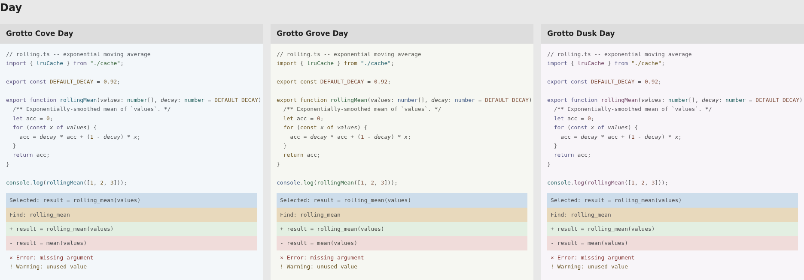

# Grotto: next-generation palettes

Start with Cove. It is my preferred balance of visible syntax accents and a
quiet background. Grove gives keywords a warmer emphasis; Dusk uses muted plum
for function calls. Each direction has Day and Night versions.

| Direction | Functions and builtins | Keywords | Strings |
| --- | --- | --- | --- |
| Cove | Blue | Lilac | Green |
| Grove | Green | Amber | Blue-green |
| Dusk | Plum | Purple | Gold |

## Compare the code





Open [comparison.html](comparison.html) locally for R, TypeScript, Python, and
color-vision simulations. The pictures show browser specimens using actual
palette colors, not screenshots of an editor. The state rows use opaque fills;
editor overlays and grammar scopes can change the appearance.

## Try the themes

The local installer is `dist/grotto-next-generation-0.1.0.vsix` at the repository
root. In VS Code, run **Extensions: Install from VSIX...**, select that file,
and then choose a `Grotto Cove`, `Grotto Grove`, or `Grotto Dusk` theme.
This preview has its own extension ID, so it can coexist with the older themes.

To try it without installing, run from the repository root:

```bash
code --extensionDevelopmentPath="$PWD/out/next-generation/vscode-preview"
```

For Zed, select **Install Dev Extension** and choose
`out/next-generation/zed-preview`, then select one of the six themes.
Both previews contain static theme data. Switching is manual.

To build the VSIX yourself, with Node.js and npm installed:

```bash
mkdir -p dist
cd out/next-generation/vscode-preview
npx --yes @vscode/vsce@3.9.2 package --no-dependencies --out ../../../dist/grotto-next-generation-0.1.0.vsix
```

Choose the direction you prefer and point to anything that is too faint, too
prominent, or hard to distinguish. Check selected code and diffs as well as
ordinary text. No palette is selected for release yet.

## What changed

The starting points are authored directly in OKLCH. A small deterministic search
adjusts the syntax groups near those starting points. It penalizes missing
separation on four selected role pairs, departures from the authored colors,
and excessive chroma weighted by character coverage across the three specimens.
It gives no reward for increasing separation beyond the target.

Functions and builtins share a color. Numbers, named constants, and decorators
share another. Types, namespaces, and tags form a third group. Variables and
parameters stay neutral; recognized parameters remain italic. The error accent
is red, the warning accent amber, and diff fills stay muted green/red.

All three directions use the same state colors so the comparison focuses on
syntax and the canvas. Removed-line fills also differ in lightness from added
lines. Diff gutter markers use the stronger success/error/warning colors instead
of borrowing the low-contrast background fills. Zed's write-highlight fill uses
selection color rather than the much brighter focus-border color.

Day's body text is darker than in the older candidates. Across the six palettes,
ordinary foreground on selection measures about 5.84:1 to 6.32:1. Every checked
body-text/surface pair is above 4.60:1, including comments and punctuation.

## Checks and limits

[metrics.json](metrics.json) records each palette's contrast checks, syntax
chroma, error/warning distances under simulations, and search loss. It checks
289 authored ink/surface pairs per palette and separately checks exported editor
backgrounds, including alpha composition and nested VS Code diff washes.

The search's weights, hue windows, chroma limits, and 0.07 role-distance target
are design choices. This set compares authored directions; it does not isolate
the effect of each optimizer setting. The reported loss is not a beauty score.

[Deutan Night](night-r-deutan.png) and [tritan Day](day-r-tritan.png) examples show
remaining color confusion. Errors and warnings still need labels or distinct
icons, and diffs still need signs. These themes do not satisfy every pairwise
CVD-distance target in the original research specification.

The checks cover a bounded model of editor backgrounds. They do not certify the
whole editor, actual font rasterization, disabled/faded text, collaboration
cursors, HDR behavior, or all possible overlapping decorations. A real-editor
smoke test and ordinary coding sessions are still needed before release.

## Rebuild

From the repository root:

```bash
uv run python scripts/next_palette.py
uv run pytest -q tests/test_next_palette.py
```

The generator reuses Grotto's color math, report renderer, and editor adapters.
It does not modify the original candidates or search scripts. The input hashes
are in [inputs.json](inputs.json); each generated editor theme also records its
palette hash. PNGs are fixed browser captures at a 1920px viewport, device scale
1, with DejaVu Sans Mono at 13px. Recapture them if palette colors or the layout
change.
