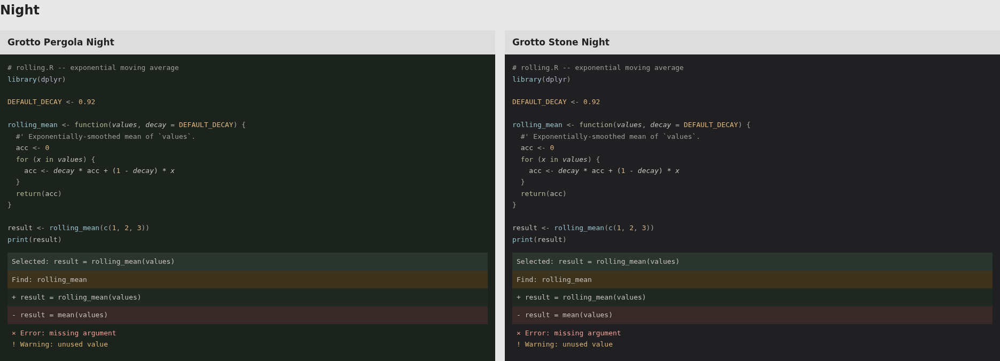
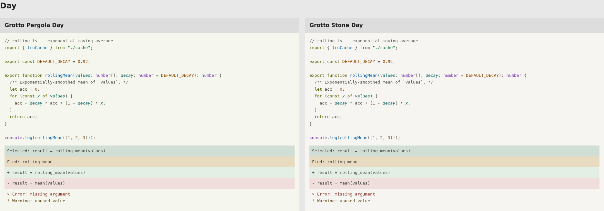

# Grotto: summer memories

Four additional review themes, based on summers beneath kiwi vines and evenings
at stone tables: cool shade, foliage, mineral surfaces and small pools of warm
light. These are interpretations of a personal memory, not claims that colors
produce the same feelings in everyone.

Cove, Grove and Dusk remain available in the [previous generation](../next-generation/README.md).

| Direction | Day | Night |
| --- | --- | --- |
| Pergola | Pale stone with a green cast | Green-black shade |
| Stone | Pale, slightly warm mineral grey | Nearly neutral charcoal |

Day uses yellow-green keywords, blue functions, leaf-green strings, violet types and
copper numbers/constants. Parameters and properties use teal. Its stronger colors address the first review, where
the text looked almost uniformly grey. Night keeps the original softer colors
and amber numbers/constants; Stone Night's greens are softer. Ordinary text is a
slightly warm neutral. Red errors and amber warnings retain their usual roles.

## Compare code

[More color in recurring roles](coverage-study/README.md) compares the latest
Day revision with its predecessor and the four reference themes.

[Compare Grotto with established light themes](theme-comparison/README.md):
Catppuccin Latte, GitHub Light Default, VS Code Light+ and Solarized Light,
using the same code and TextMate grammars.

[Stronger Day colors](day-strength-study.html) compares the previously preferred
revision with the current, more colorful version. It keeps the chosen hues and
allows Day syntax up to 98% of the available sRGB chroma, instead of 75%.
Night, backgrounds and neutral text are unchanged.

[Day color study](day-color-study.html) compares the original, increased chroma
with the original hues, and the revised Day hues. It preserves the original
Day colors from commit `e57b1f8` for review.





Open [comparison.html](comparison.html) for R, TypeScript and Python, with
normal vision and three color-vision simulations. These are browser specimens,
not screenshots of an editor. Editor tokenization and overlapping decorations
can change the result. The comparison links to Cove, Grove and Dusk.

I prefer Pergola Night for this brief: the green canvas gives the warm accents
some context. Stone offers a quieter alternative if the green feels too literal.
The Day versions differ more subtly.

## Install alongside the previous themes

In VS Code, run **Extensions: Install from VSIX...** and select
`dist/grotto-summer-memories-0.1.0.vsix` from the repository root. Then choose
**Grotto Pergola Day**, **Grotto Pergola Night**, **Grotto Stone Day** or
**Grotto Stone Night** from **Preferences: Color Theme**.

The extension has its own ID. It can coexist with all previous previews.
For Zed, choose **Install Dev Extension** and select
`out/summer-memories/zed-preview`. Switching is manual in both editors.

## Design and checks

The palette is authored directly. The generator repairs text lightness until
it passes the configured contrast floors, with 0.1 ratio headroom. Gamut handling
can also reduce chroma. Day syntax uses a 98% gamut limit; other colors retain
the 75% limit. These are design choices, not accessibility requirements. There is no aesthetic search or beauty score in this
generation. It reuses the earlier contrast checks, renderer and editor exporters.

Frequent syntax colors stay relatively restrained. Warm amber/copper belongs to numbers,
constants and decorators, which occupy a smaller share of these specimens.
That is a choice of role mapping, not a guaranteed coverage limit: a numeric
configuration file can contain much more amber. Check one before choosing.

[metrics.json](metrics.json) records 289 authored ink/surface checks per theme,
plus checks against exported editor backgrounds, including alpha composition.
The minimum checked body-text contrast exceeds 4.60:1. It also records requested
and shipped syntax colors, amber character coverage, and error/warning distances
under color-vision simulations.

Related syntax colors can remain hard to distinguish, especially under
simulations. Errors and warnings need labels or distinct icons; diffs need signs.
Passing these checks does not certify the full editor or establish reading
comfort. Real-editor use remains part of the review.

## Rebuild

From the repository root:

```sh
uv run python scripts/memory_palette.py
uv run pytest -q tests/test_memory_palette.py tests/test_next_palette.py
```

To package the VS Code themes:

```sh
mkdir -p dist
cd out/summer-memories/vscode-preview
npx --yes @vscode/vsce@3.9.2 package --no-dependencies --out ../../../dist/grotto-summer-memories-0.1.0.vsix
```

The generator writes only this generation's directory. Input hashes are in
[inputs.json](inputs.json). PNGs are browser captures at a 1920px viewport,
device scale 1, with DejaVu Sans Mono at 13px.
