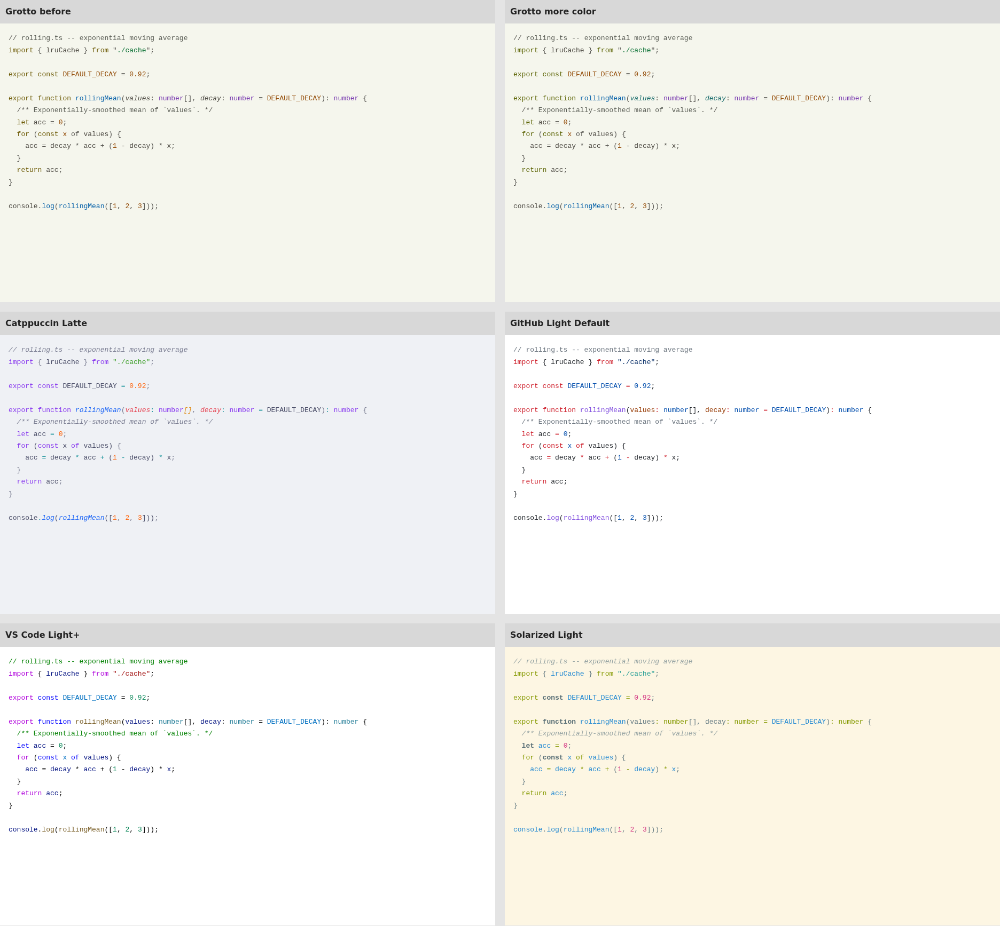

# A little more color in Day

[Open the comparison](comparison.html). The first row shows the previous and
revised Grotto Day theme. Catppuccin Latte, GitHub Light Default, VS Code Light+
and Solarized Light follow for context. Choose TypeScript, Python or R.

The revision colors parameters and properties teal and shifts keywords from
ochre toward yellow-green. Ordinary variables, comments, operators and punctuation
keep their neutral colors. Functions, strings, types and numbers keep the
previous accents. Backgrounds and Night palettes are unchanged.

This is a modest step. Across the three shared TextMate specimens, mean OKLCH
chroma weighted by non-whitespace characters rises from 0.0447 to 0.0490, about
10%. Reference themes range from 0.0805 to 0.1394. That is a description of color
usage, not a measure of perceived pop or beauty.

Parameters and properties receive color only where the grammar or semantic
provider identifies them. The browser comparisons use Shiki 4.4.3 and TextMate
rules, without semantic highlighting. Earlier Grotto role specimens identify
more parameter uses by hand, so they can show more teal than the grammar does.
Both previews are useful; neither is a full editor screenshot.

All four generated themes pass the configured text contrast checks, including
selection and modeled editor overlays. All 20 focused palette tests pass.

The previous theme is preserved in [before.json](before.json), from commit
`04507f8`. Source counts are in [token-colors.json](token-colors.json), and
[mean-chroma.json](mean-chroma.json) contains the pooled means. Reference sources
and measurement limits are documented in the [earlier comparison](../theme-comparison/README.md).

To rebuild the HTML and token counts, install `shiki@4.4.3` in a temporary Node
project, copy [build.mjs](build.mjs) there, then run
`node build.mjs /absolute/path/to/grotto`. Screenshots use a 1920px viewport,
device scale 1, and DejaVu Sans Mono at 13px.
