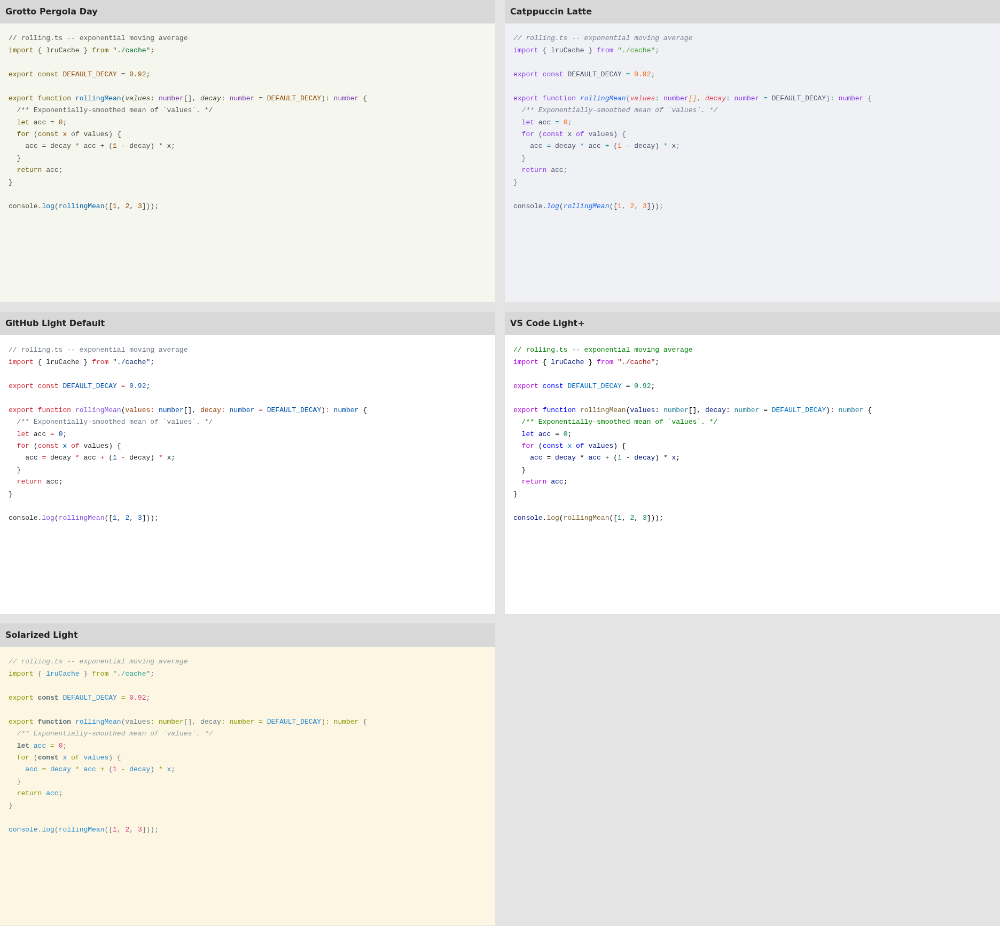

# Grotto beside established light themes

[Open the comparison](comparison.html). Choose TypeScript, Python or R.

The stronger Grotto Day revision still looks quieter than these four references.
Its blue and violet accents are now visible, but its common keywords are ochre,
comments are nearly neutral, and variables and operators mostly stay neutral.
The other themes often color more of those roles as well as using stronger accents.

| Theme | Mean chroma across visible characters | Visual reading |
| --- | ---: | --- |
| Grotto Pergola Day | 0.045 | Dark, restrained accents amid much neutral text |
| Solarized Light | 0.081 | More teal/blue throughout the code; lighter overall |
| GitHub Light Default | 0.103 | Red keywords, blue constants and purple functions stand out |
| Catppuccin Latte | 0.115 | Purple keywords, blue functions, peach parameters and colored operators |
| VS Code Light+ | 0.139 | Strong blue/purple syntax, blue variables and green comments |

These are pooled OKLCH chroma means weighted by non-whitespace character counts
across three specimens. They describe how much color the renderer used; they
are not a perceptual pop score, a beauty score, or a reading-performance measure.
Comments and neutral text are included. Backgrounds, font weight and italics
also affect the visual result and are not captured by this number.

Grotto's mean chroma among characters above a chosen C=0.04 threshold is 0.120,
compared with 0.144–0.180 for the references. Its smaller colored share also
contributes to the difference. The threshold is a descriptive convention, not
a visibility boundary. Full counts and metrics are in [token-colors.json](token-colors.json)
and [metrics.json](metrics.json).

## What was compared

All five themes use the same source text, TextMate grammars and font in Shiki
4.4.3. Grotto uses the current exported VS Code Pergola Day theme. Stone Day has
the same syntax colors and is omitted to avoid repetition. This checks actual
TextMate mappings rather than substituting our own semantic role labels.
VS Code semantic highlighting can change these assignments. These are browser
renders, not editor screenshots or claims about the latest Marketplace releases.
No palette colors were changed for this comparison.

The four references are Shiki 4.4.3 snapshots of:

- [Catppuccin Latte](https://github.com/catppuccin/vscode)
- [GitHub Light Default](https://github.com/primer/github-vscode-theme)
- [VS Code Light+](https://github.com/microsoft/vscode/tree/main/extensions/theme-defaults)
- [Solarized Light for VS Code](https://github.com/microsoft/vscode/tree/main/extensions/theme-solarized-light)

[Shiki](https://github.com/shikijs/shiki) supplies the theme snapshots and grammars.
Input hashes are recorded in [inputs.json](inputs.json). This is a selection of
established themes, not a measured popularity ranking.

## Reproduce the HTML and token counts

Install `shiki@4.4.3` in a temporary Node project, copy [build.mjs](build.mjs)
into that directory, then run `node build.mjs /absolute/path/to/grotto`.
The source samples are in [samples.json](samples.json). Screenshots use a
1920px viewport, device scale 1, and DejaVu Sans Mono at 13px.
