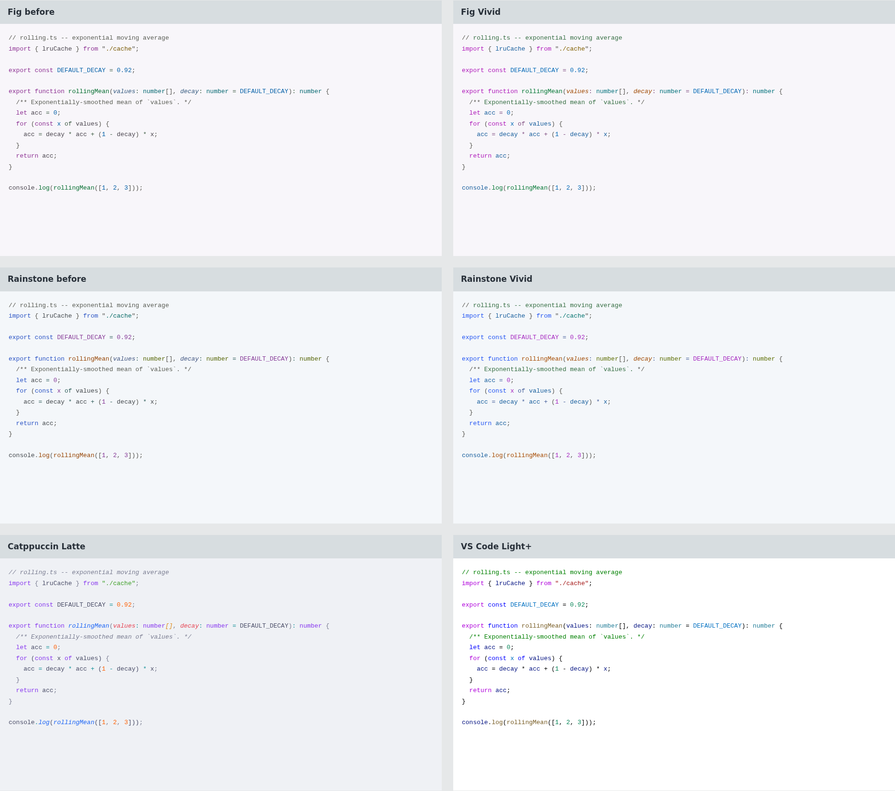

# Grotto, with more color

[Open the before/after comparison](comparison.html). Fig Vivid and Rainstone
Vivid each have Day and Night. The earlier studies appear beside them, with
Catppuccin and VS Code defaults below for context.



The previous rounds kept too much of the code grey. These revisions color
ordinary variables blue, parameters copper and comments green, alongside
stronger keyword/function/string accents. Operators also carry more color.
Unclassified Python tokens use the variable color as a fallback; deeper rules
still style comments, punctuation, functions and other recognized categories.

Day's selection, search and diff fills are lighter. This gives lighter colored
inks room to pass the same contrast floors across those states. The canvas and
ordinary UI text retain their earlier colors. Night increases both chroma and
color coverage. These are deliberately bolder alternatives; the earlier palettes
remain unchanged.

## What changed in the comparison

The gallery uses actual TextMate theme rules through Shiki 4.4.3, with matching
code, font and size across all themes. TypeScript, Python, R, JSON and CSS are
available. Semantic highlighting in an editor may change individual assignments.

Mean OKLCH chroma across non-whitespace characters is recorded in
[mean-chroma.json](mean-chroma.json). The final Day revisions are near Catppuccin
Latte on that measure; the Night revisions exceed the two reference snapshots.
This describes color use, not perceived pop or a quality score.

[State specimens](role-specimens.html) cover selections, diffs, diagnostics and
color-vision simulations. These use hand-labelled roles. Their neutral `fg`
spans do not represent the new variable mapping, so use the main gallery to
judge ordinary code. No browser preview is a full editor screenshot.

## Try the themes

In VS Code, run **Extensions: Install from VSIX...**, select
`dist/grotto-vivid-studies-0.1.0.vsix`, then choose **Grotto Fig Vivid Day/Night**
or **Grotto Rainstone Vivid Day/Night**.

For Zed, choose **Install Dev Extension** and select `out/vivid-studies/zed-preview`.
The preview has its own extension ID, so the existing proposals remain available.
Switching is manual.

## Validation

All four themes pass the configured contrast checks, including 289 authored
ink/surface combinations and 29 modeled editor backgrounds per theme. The
minimum checked body-text contrast exceeds 4.60:1. The contrast repair still
checks the exported colors; stronger color does not bypass the floor.

The last full suite run passed 546 tests. All 34 palette tests passed after
the final mapping adjustment. The preview builder also checks actual variable
and function colors in R, TypeScript and Python to catch broad fallback rules
that accidentally recolor function calls. The gallery was checked in both
variants and all five languages, with no JavaScript errors or mobile overflow.

Color-vision simulations remain checks, not certification. Diagnostic labels
and diff signs remain necessary. Font rendering, full-editor behavior and
sustained use still need review.

## Rebuild

Run `uv run python scripts/vivid_palette.py` from the repository root.
Install `shiki@4.4.3` in a temporary Node project, copy `scripts/vivid_preview.mjs`
there, then run `node vivid_preview.mjs /absolute/path/to/grotto`.
With Python Playwright installed, run `python3 scripts/capture_vivid.py` from
the repository root to recapture screenshots.

Package from `out/vivid-studies/vscode-preview`:

```sh
npx --yes @vscode/vsce@3.9.2 package --no-dependencies --out ../../../dist/grotto-vivid-studies-0.1.0.vsix
```

Input hashes are in [inputs.json](inputs.json) and
[preview-inputs.json](preview-inputs.json). Rendered token counts are in
[token-colors.json](token-colors.json). Screenshots use a 1920px viewport,
device scale 1, and DejaVu Sans Mono at 13px.

Reference sources: [Catppuccin](https://github.com/catppuccin/vscode) and
[VS Code default themes](https://github.com/microsoft/vscode/tree/main/extensions/theme-defaults),
as shipped in Shiki 4.4.3. These are pinned comparison snapshots, not a claim
about the latest Marketplace releases.
